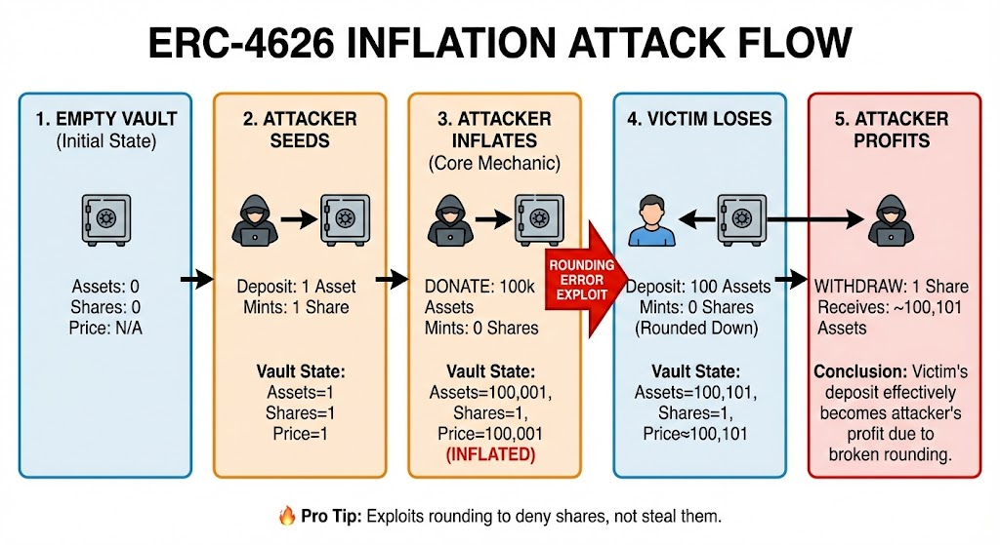

# ERCs and EIPs

**ERCs** (Ethereum Request for Comment) are interface standards at the application level. Hence, they do not require Ethereum protocol upgrades to be adopted.&#x20;

The broader umbrella, **EIPs** (Ethereum Improvement Proposals), includes ERCs but also covers protocol-level changes that modify the network itself. Such changes typically require significantly longer review, testing, and community consensus before they can be approved and implemented.

Simply put:

👉 ERCs usually do NOT require chain upgrades.&#x20;

👉 Protocol EIPs DO require upgrades (hard forks).

## ERCs

These ERCs serve as the crucial building blocks of Ethereum. Think of them like Lego blocks which serves as the fundamental layer of smart contracts.

### ERC-20 (Fungible Token Standard)

ERC-20 standardizes **fungible tokens** on Ethereum by defining a minimal interface for balance tracking, transfers, and delegated spending, forming the foundation of most DeFi infrastructure.

<table data-header-hidden><thead><tr><th width="273.22198486328125"></th><th width="472.3331298828125"></th></tr></thead><tbody><tr><td><strong>Function</strong></td><td><strong>Purpose</strong></td></tr><tr><td><p><code>transfer(address _to,</code> </p><p><code>uint256 _value)</code></p></td><td>Direct Send. Moves tokens from the caller's wallet to <code>_to</code>.</td></tr><tr><td><code>transferFrom(address _from, address _to, uint256 _value)</code></td><td>Delegated Send. Moves tokens from <code>_from</code> to <code>_to</code>. Used by contracts to move your funds.</td></tr><tr><td><p><code>approve(address _spender,</code> </p><p><code>uint256 _value)</code></p></td><td>Authorize. Allows <code>_spender</code> to withdraw up to <code>_value</code> from your account.</td></tr><tr><td><p><code>allowance(address _owner,</code> </p><p><code>address _spender)</code></p></td><td>Check Limit. Returns the remaining amount <code>_spender</code> can withdraw.</td></tr></tbody></table>

***

### ERC-721 (NFT Standard)

ERC-721 is a foundational Ethereum standard that introduced verifiable uniqueness to digital asset ownership, enabling tokens to be provably distinct and non-interchangeable. The standard’s potential became evident with early projects such as CryptoKitties, and was later reinforced by the 2021 NFT boom.&#x20;

Today, ERC-721 remains a critical standard for representing unique digital items and real-world assets (**RWAs**), and plays a vital role in emerging areas such as AI-agent identity frameworks (e.g., **ERC-8004**).

<table data-header-hidden><thead><tr><th width="191.4444580078125">Function</th><th width="139.11114501953125">Category</th><th>Purpose</th></tr></thead><tbody><tr><td><strong>Function</strong></td><td><strong>Category</strong></td><td><strong>Purpose</strong></td></tr><tr><td><code>ownerOf(uint256)</code></td><td>Ownership</td><td>Defines ownership at the <strong>token level</strong>, enabling non-fungibility. ERC-20 tracks balances only, not individual assets.</td></tr><tr><td><code>tokenURI(uint256)</code></td><td>Metadata</td><td>Associates each token with unique metadata, foundational for collectibles, art, and RWAs.</td></tr><tr><td><p><code>safeTransferFrom</code></p><p><code>(address,</code></p><p><code>address,uint256)</code></p></td><td>Safe transfer</td><td>Performs transfers with receiver validation to prevent asset loss.</td></tr><tr><td><p><code>onERC721Received</code></p><p><code>(address,address,</code></p><p><code>uint256,bytes)</code></p></td><td>Contract safety</td><td>Ensures recipient contracts explicitly accept NFTs, eliminating a major class of asset-loss errors.</td></tr></tbody></table>

***

### ERC-165 (Interface Detection)

An interface can be identified by a 4-byte fingerprint computed as the XOR of its function selectors, enabling contracts to verify whether another contract implements the expected interface.

Using `supportsInterface(bytes4)` , we can safely detect whether a target implements an interface before interacting with it, preventing failed calls to functions that don't exist and enabling permissionless contract composition.

**Why ERC-165 Matters**

* **Safer interactions** — lets contracts verify capabilities before calling, reducing failed executions.
* **Enables composability** — makes it possible for independent protocols to interoperate predictably.
* **Forward compatibility** — contracts can detect and support new extensions without redeployment.
* **Modular design** — allows optional features instead of forcing rigid, monolithic standards.
* **Ecosystem scalability** — supports generalized tooling and permissionless integrations.

***

### ERC-1155 (Multi-token Standard)

While previous iterations defined clear standards for tokens in ERC-20 and ERC-721, it became inefficient when applications — such as games with multiple token and asset classes — required separate contracts for each fungible token and NFT, leading to duplicated logic, higher deployment costs, and fragmented approvals.

With ERC-1155, a single contract can manage multiple token types using unique token IDs, eliminating the need for separate deployments and greatly improving gas efficiency. This design enables **batch transfers of multiple tokens within one transaction,** reducing overhead and improving scalability.

The standard also includes `setApprovalForAll`, allowing an operator to manage an entire collection of tokens without per-token approvals, while `balanceOfBatch` enables balances across multiple token IDs to be queried in a single call.

<table data-header-hidden><thead><tr><th width="331.333251953125">Function</th><th>Purpose</th></tr></thead><tbody><tr><td><strong>Function</strong></td><td><strong>Purpose</strong></td></tr><tr><td><code>safeTransferFrom(address from, address to, uint256 id, uint256 amount, bytes data)</code></td><td>Transfers a specific token type safely, ensuring the recipient contract can accept ERC-1155 tokens.</td></tr><tr><td><code>safeBatchTransferFrom(address from, address to, uint256[] ids, uint256[] amounts, bytes data)</code></td><td>Transfers multiple token types in a single transaction for improved gas efficiency.</td></tr><tr><td><p><code>balanceOf(address account,</code> </p><p><code>uint256 id)</code></p></td><td>Returns the balance of a specific token ID for an address.</td></tr><tr><td><p><code>balanceOfBatch(address[]</code> </p><p><code>accounts, uint256[] ids)</code></p></td><td>Fetches balances for multiple accounts and token IDs in one call.</td></tr><tr><td><code>setApprovalForAll(address operator, bool approved)</code></td><td>Grants or revokes permission for an operator to manage all of the caller’s tokens.</td></tr><tr><td><code>isApprovedForAll(address account, address operator)</code></td><td>Checks whether an operator is authorized to manage an account’s tokens.</td></tr></tbody></table>

***

### ERC-2612 (Permit Extension for ERC-20)

EIP-2612 was introduced to improve the user experience of ERC-20 tokens. Traditionally, interacting with ERC-20 tokens requires two transactions: an `approve` call from the user, followed by a `transferFrom` executed by the receiving contract. This process can be inconvenient, as users must hold ETH to pay for gas before transferring their tokens.

EIP-2612 addresses this by introducing the `permit` function, which allows approvals to be authorized via an <mark style="color:$warning;">off-chain EIP-712 typed signature</mark> `(v, r, s)` instead of an on-chain transaction. A relayer can then submit the transaction on the user’s behalf, enabling <mark style="color:$warning;">gasless approvals</mark> and significantly reducing friction in token interactions.

<table data-header-hidden><thead><tr><th width="279.77777099609375">Function</th><th>Purpose</th></tr></thead><tbody><tr><td><strong>Function</strong></td><td><strong>Purpose</strong></td></tr><tr><td><code>permit(address owner, address spender, uint256 value, uint256 deadline, uint8 v, bytes32 r, bytes32 s)</code></td><td>Approves token allowance via an <a href="https://eips.ethereum.org/EIPS/eip-712">EIP-712</a> signature, removing the need for an on-chain <code>approve</code> transaction.</td></tr><tr><td><code>nonces(address owner)</code></td><td>Returns the current nonce for an owner, ensuring each signature is unique and preventing replay attacks.</td></tr><tr><td><code>DOMAIN_SEPARATOR()</code></td><td>Provides the domain used in signature hashing, binding signatures to a specific contract and chain to prevent cross-domain reuse.</td></tr></tbody></table>

This concept has been further extended by Uniswap through [Permit2 and the Uniswap Universal Router](https://blog.uniswap.org/permit2-and-universal-router). Permit2 introduces a unified approval system that works even for tokens deployed before EIP-2612, enabling signature-based permissions without requiring native permit support.

Permit2 enhances allowance safety by replacing unlimited approvals with granular, time-bound permissions. It supports batch transfers and batch revocations, reducing the attack surface associated with forgotten infinite allowances while giving users greater control over token permissions.

In traditional ERC-20 flow, users typically grant infinite approvals for convenience:

```solidity
approve(spender, type(uint256).max)
```

If a protocol is compromised, attackers can exploit existing token allowances <mark style="color:red;">to drain user funds entirely.</mark>

Permit2 reduces the risks associated with unlimited allowances by enabling signature-based permissions that are scoped to a specific transaction. Users can define an <mark style="color:$warning;">exact token amount, set an expiration time, and restrict approvals</mark> to a designated spender or protocol, significantly limiting the potential blast radius of a compromise.

It also introduces <mark style="color:$warning;">batch transfers and batch revocations</mark>, allowing multiple permissions to be managed within a single transaction. This improves usability while maintaining strong security guarantees by giving users greater control over their token approvals.

Complementing this, the Uniswap Universal Router enables complex, multi-step operations — such as optimized swaps across multiple tokens and liquidity sources — to execute atomically in one call. This supports advanced routing strategies, including split execution across Uniswap V2 and V3, improving price efficiency while simplifying the overall user experience.

Because these operations are atomic, any failure causes the entire transaction to revert, preventing partial execution and helping protect user funds.

***

### ERC-4626 (Tokenized Vaults)

yield can fluctuate both positively and negatively. Imagine a vault targeting around 20% APR: Alice deposits 100 USDC, and Bob deposits 50 USDC months later. When they withdraw, how do we ensure Alice receives the amount she rightfully earned? Since returns are variable and not strictly time-based, we cannot rely on a simple formula like `deposit × APR × time`.

Instead, vaults use a <mark style="color:$warning;">share-based accounting model</mark>. Depositors receive shares representing their <mark style="color:$warning;">proportional ownership</mark> of the vault, and as the vault gains or loses assets, the value of each share adjusts automatically. Rather than tracking yield per user, the vault tracks ownership—users redeem their shares for a corresponding portion of the vault’s assets, ensuring fair distribution of profits and losses regardless of deposit timing.

By tracking the vault’s total assets and total shares, we can determine how many shares to mint on deposit and how many shares to burn on withdrawal. The conversion is based on the current share price, typically computed as the ratio of total shares to total assets.

For a given asset amount `a`, the shares to mint or burn can be calculated as:

<mark style="color:yellow;">**s = (a × T) / A**</mark>

where  `T` is the total shares outstanding,  `s` is the number of shares to mint or burn, and `A` is the total assets in the vault.

Also a big shout out to [Smart Contract Programmer](https://youtu.be/k7WNibJOBXE) for these visualizations and detailed explanations.

<figure><figcaption></figcaption></figure>

<figure><figcaption></figcaption></figure>

Now that we understand the basics of how vaults operate, we need a way to standardize this behavior in smart contracts so that different protocols can integrate with them reliably. ERC-4626 provides this standard by defining a common interface for tokenized vaults.&#x20;

ERC-4626 organizes vault interactions into several key function groups.&#x20;

<table data-header-hidden><thead><tr><th width="116.77783203125">Category</th><th width="285.4444580078125">Example Functions</th><th>Purpose</th></tr></thead><tbody><tr><td><strong>Category</strong></td><td><strong>Example Functions</strong></td><td><strong>Purpose</strong></td></tr><tr><td><strong>Convert</strong></td><td><code>convertToShares</code>, <code>convertToAssets</code></td><td>Provides a read-only, fee-neutral exchange rate between assets and shares</td></tr><tr><td><strong>Preview</strong></td><td><code>previewDeposit</code>, <code>previewMint</code>, <code>previewWithdraw</code>, <code>previewRedeem</code></td><td>Simulates the result of a transaction without changing state</td></tr><tr><td><strong>Max (Limit)</strong></td><td><code>maxDeposit</code>, <code>maxMint</code>, <code>maxWithdraw</code>, <code>maxRedeem</code></td><td>View the current max allowed interaction for the user</td></tr><tr><td><strong>Execution</strong></td><td><code>deposit</code>, <code>mint</code>, <code>withdraw</code>, <code>redeem</code></td><td>Performs the actual asset transfer and mints/burns shares</td></tr></tbody></table>

[The Ethereum documentation](https://ethereum.org/developers/docs/standards/tokens/erc-4626/) offers a well-crafted summary of the core functions that every ERC-4626 vault should implement:

<figure><figcaption></figcaption></figure>

However, ERC-4626 vaults can be vulnerable to an <mark style="color:$danger;">**inflation attack**</mark>. In this attack, a malicious actor frontruns the first deposit by contributing a small amount of assets to mint shares, then donates a large amount directly to the vault without receiving additional shares.&#x20;

This manipulation skews the vault’s exchange rate, causing subsequent small deposits to round down to zero shares. When a vault is empty or holds very few assets, an attacker can manipulate the exchange rate with relatively little capital, effectively turning victim deposits into donations.

The attacking flow can be represented as below:

<figure><figcaption></figcaption></figure>

After acquiring an initial majority of shares, the attacker artificially increases the vault’s total assets by donating funds directly to the contract. Because this donation does not mint new shares, the attacker retains a dominant ownership percentage while drastically skewing the exchange rate. When a victim later deposits an amount that is small relative to the inflated vault balance, the share calculation may round down to zero, effectively turning the deposit into a donation that benefits the attacker.

Several mitigations exist to protect vaults from inflation attacks. One approach enforces a **minimum share** threshold for deposits, <mark style="color:$warning;">reverting transactions that would mint too few shares</mark> and preventing deposits from rounding down to zero.

Another method uses **internal accounting** to track deposited assets instead of relying on the raw token balance. Because <mark style="color:$warning;">direct donations bypass deposit logic, excluding them</mark> prevents attackers from artificially inflating the exchange rate.

A third defense mints a small number of **dead shares** during initialization. These permanently locked shares ensure the <mark style="color:$warning;">total supply is never near zero</mark>, making it expensive for an attacker to gain dominant ownership and reducing the profitability of donation-based manipulation.

A more robust mitigation introduces a decimal offset, as implemented by [OpenZeppelin](https://docs.openzeppelin.com/contracts/5.x/erc4626). The core idea is to give shares significantly more decimal precision than the underlying asset.&#x20;

By increasing share precision and incorporating virtual shares and assets, the vault starts with an <mark style="color:$warning;">anchored exchange rate</mark> that minimizes rounding effects. As a result, executing an inflation attack becomes economically impractical, requiring significantly more capital than the attacker could extract.

This approach is widely regarded as a production-grade and mathematically elegant mitigation, as it requires only two additional constants to significantly strengthen the vault against inflation attacks.

**Before:**

```solidity
shares = assets * totalSupply / totalAssets
```

**After:**

```solidity
uint256 private constant VIRTUAL_ASSETS = 1;
uint256 private constant VIRTUAL_SHARES = 1e12; // decimal offset

shares = assets * (totalSupply + VIRTUAL_SHARES)
         / (totalAssets + VIRTUAL_ASSETS);
```
